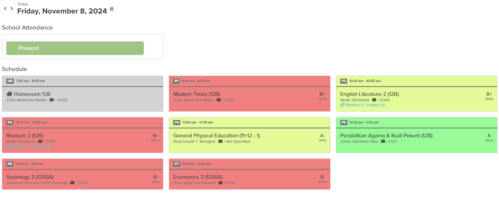
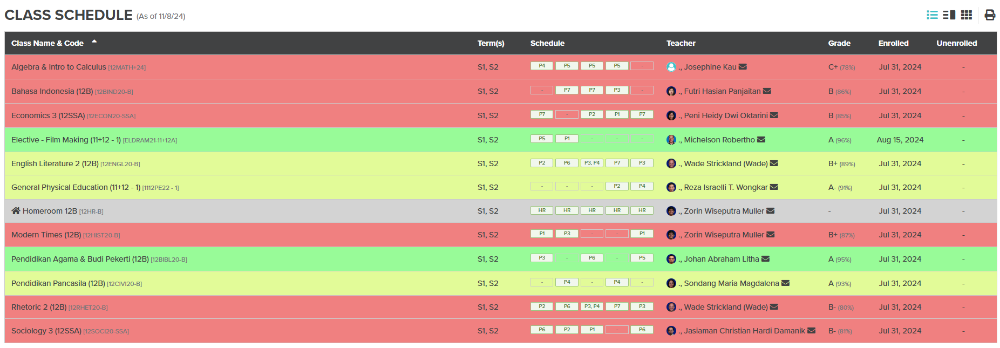
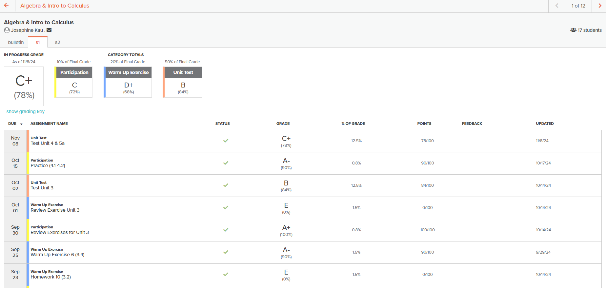

# Chrome Extension: ALMA Grades Highlighter

This Chrome extension customizes the ALMA school information system, helping users visually differentiate grades by highlighting them with background colors based on their score values.

## Features

- **Grade Highlighting**: Colors the background of grade elements for easier identification of high and low scores.
  - Green background for scores above 95%
  - Yellow background for scores between 80% and 94%
  - Red background for scores below 80%
- **Class Management**: Removes specific CSS classes from elements for a custom look.
  
## Screenshots
 
 


## Installation

1. **Clone or Download** the repository:
   ```bash
   git clone https://github.com/yourusername/your-repo-name.git
   ```
2. **Load the extension in Chrome**:
   - Open `chrome://extensions/` in Chrome.
   - Enable **Developer mode** (toggle on the top right).
   - Click **Load unpacked** and select the directory where you downloaded/cloned this repository.

## Usage

- Navigate to the ALMA website.
- Grades will be highlighted based on their value, with color-coded backgrounds for quick visual assessment.

## Files

- `manifest.json`: Configures the extension, including permissions and files.
- `content.js`: Contains JavaScript for selecting and modifying elements based on grade values.
- `styles.css`: Defines styles applied to grade elements.
  
## How It Works

1. **Grade Identification**: The `content.js` script finds grade elements on ALMA's web page using specific selectors.
2. **Class Modification**: Certain CSS classes are overridden or removed to ensure clear background color coding.
3. **Visual Customization**: Colors indicate high, medium, or low grades.

## Contributing

Contributions are welcome! Please feel free to open issues or pull requests.

## License

This project is not licensed. Contact @smattsil on IG if you have any issues.
